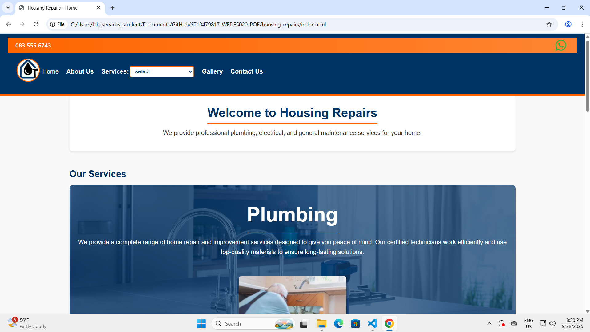

# Housing Repairs WEDE5020 

## Student Information
- Name: Tyric Singh
- Student ID: ST10479817
- Module: WEDE5020
- Submission: POE Part 1

## Project Overview
Housing Repairs is a hypothetical small business that started in 2021 to provide professional plumbing and general home maintenance services to residents and apartments in Johannesburg.  
The project aims to develop a responsive website that provides information about services, allows customers to request quotes or book services, showcases previous work, and improves online visibility for the business.

## GitHub Link
Link: https://github.com/ST10479817/ST10479817-WEDE5020-POE.git 

## Website Goals and Objectives

### Goals
•	Presenting a professional online presence for Housing Repairs
•	Allow users to easily navigate the website to book services or request quotes.
•	Present all services clearly to educate customers.
•	Build trust and credibility with customers.
•	Increase online visibility and search presence.

### Objectives
•	We need to generate 20 or more services inquiries per month through online forms.
•	To improve Customer engagement by offering 24/7 service booking.
•	Providing detailed service pages to reduce the number of customers support queriers.
•	Insure to we have consent traffic.
•	Creating an enquiry from (using Google Forms) that lets users book services or request a free quote.

## Key Features and Functionality
1.	Homepage
•	Top-level navigation bar
•	Information presented in a professional way
•	Images 
2.	About Us
•	Company history and mission
•	Certifications
•	Brand logos
3.	Services
•	Links to 3 websites
•	Information about all services
•	Images 
4.	Gallery 
•	All types of images about the business previous work
5.	Contact Page
•	Top-level navigation bar
•	Embedded Google Map
•	Embedded Google Form
6. Other feactures
•	Responsive Designs with the ablity to adapt to deskop, tablet and mobile screens
•	Responsive images and flexible layout

## Timeline and Milestones

### Part 1
Choosing a Target Organisation
Research and Planning
Organisation Overview
Website Goals and Objectives
Website Features and Functionality
Design and User Experience
Technical Requirements
Budget
Research and Sourcing
Website Structure and Planning
Sitemap
File and Folder Structure
HTML Structure
Content Integration
Navigation
Testing and debugging
Comments
GitHub Repository
Website Project Proposal
Content Research and Sourcing
HTML Files
GitHub Repository Link

### Part 2
Create an External Stylesheet
Establish a Base Style
Apply Typography Styles
Create a Layout Structure
Apply Visual Style
Breakpoints
Relative Units
Responsive Images
Test and iterate
GitHub Repository

### Part 3
Interactive Elements
Dynamic Content
On-Page SEO
Off-Page SEO
HTML Form
GitHub Repository

## Sitemap

# 9 Change Log
## Improvements:
### 9a  Rename some of the html pages
The electricalServices.html, houseMaintenance.html and plumbingServices.html as upper case letter is not allowed.
electricalServices.html into electricalservices.html
houseMaintenance.html into housemaintenance.html
plumbingServices.html into plumbingservices.html
### 9b Remove any whitespace in the code
By reducing any space between the codes.
Cleaned up excess blank lines in HTML files.
Added 
 containers to each html file to help with layouts.
Minimized spacing in CSS for neater and easier-to-read code.
### 9c Add more content on most of the web pages
I have add more information to each page.
Expanded the About Us page with company history, vision, and mission.
Enhanced service descriptions to give detailed explanations of plumbing, electrical, and maintenance services.
Added more text and structure to make pages feel complete and informative.
Included extra contact information for usability.
### 9d Proposal features and functionality
I have added more feactures and functionality information into the document. I have added more detail and changed the font in red on page 7.
### 9e Content Research and Sourcing
I have added more information with extra research. I have added more detail and changed the font in red on page 14.
### 9f ReadMe needs to be improved
I have added more infomation from Part 1 and fixed the images. I have also added Part 2 into the ReadMe.

## Improvements to Part 3:
### 9g Improve the use of 

I have added new tags and replaced the unncerrary tags with "<section>" and "<article>".
### 9h Styling Interactive Elements 
I have added more hover, focus, active to most text and buttons.
### 9i Needed to add Responsive Typography
I have improved my typography so the text will change sizes as the screen changes size.

## Part 2

### 2. CSS Styling for Desktop Solution

#### 2.1 Creating a Stylesheet
I have created a CSS file "style.css" that is linked to each page.
By using consistent naming convention in the stylesheet makes all pages look consistent and joined with the same theme.

#### 2.2 Establishing a Base Style
I have set default styles for the website for each page to use and look similar.
I have also used a CSS reset to ensure consistent styling across the pages.
"* {
    margin: 0;
    padding: 0;
    box-sizing: border-box;
}"

#### 2.3 Applying Typograph Styles
I have added classes and id's to each page to help with controlling the CSS properties.
I used all types of CSS properties to make my website look as perfect and readable as possible.

#### 2.4 Creating a Layout Structure
I have added divs to section my content and make the layout easy to create the structure.
Organized content into semantic sections (header, mainContent and footer).

#### 2.5 Applying all Visual Styles 
I have applied all different types of styles to help create my website to look as applying as possible.
Styled navigation with hover effects, shadows and rounded corners.
Added an orange border line below the header and above the footer for a polished look. Created visually distinct service boxes with aligned images and text.

### 3. Responsive Design

#### 3.1 Breakpoints
I have added the appropriate "@media" tags to work with tablets and mobile screens.

#### 3.2 Relative Units
I have added the correct units to work perfectly with each screen.

#### 3.3 Responsive Images
I have the correct tags to my images and it will react to every screen. It will get smaller depending on the size of the screen.

#### 3.4 Test and Iterate
Screenshots of the Homepage in Desktop size

Screenshots of the Homepage in Tablet size

Screenshots of the Homepage in Phone size

Screenshots of the Gallery in Desktop size

Screenshots of the Gallery in Tablet size

Screenshots of the Gallery in Phone size

## References 
GoDaddy, no date. GoDaddy Philippines. [Online]
Available at: https://www.godaddy.com/en-ph
[Accessed 6 August 2025].
Google Analytics, no date. Analytics Provision. [Online]
Available at: https://analytics.google.com/analytics/web/provision/#/provision
[Accessed 6 August 2025].
Unsplash, 2025. Unsplash Photos. [Online]
Available at: https://unsplash.com/
[Accessed 24 August 2025].
W3C, no date. Web Content Accessibility Guidelines. [Online]
Available at: https://www.w3.org/WAI/standards-guidelines/wcag/
[Accessed 6 August 2025].
WordPress.org, no date. WordPress Showcaase. [Online]
Available at: https://wordpress.org/showcase/
[Accessed 6 August 2025].
Xneelo, no date. Xneelo — South Africa. [Online]
Available at: https://xneelo.co.za/
[Accessed 6 August 2025].
Leaflet, 2010. Leaflet An open-source JavaScript library for interactive maps. [Online] 
Available at: https://leafletjs.com/
[Accessed 1 November 2025].
